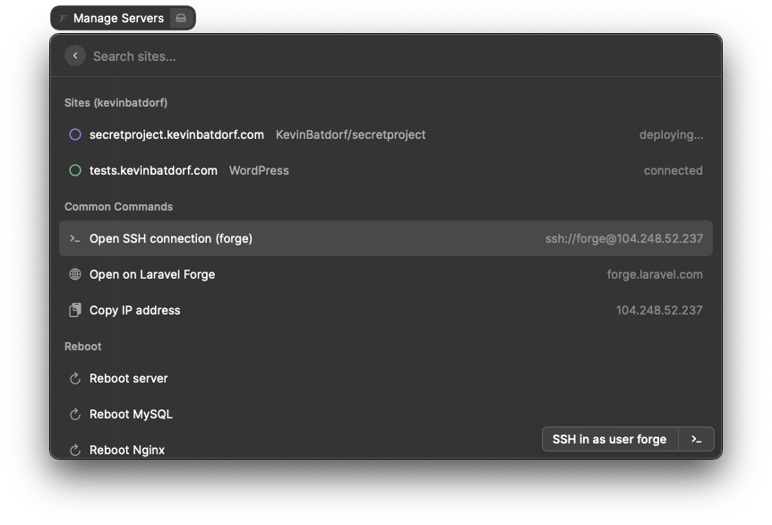
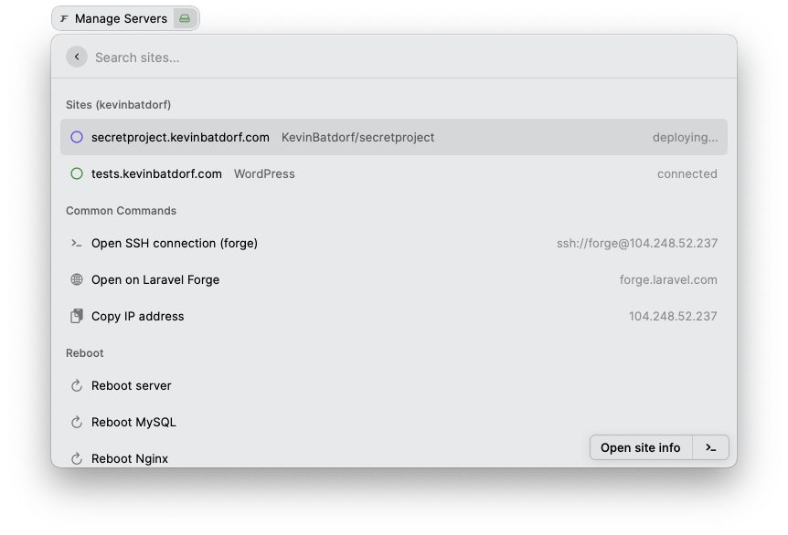

# Laravel Forge
A command center for sites managed by [Laravel Forge](https://forge.laravel.com/).

Get an API token here: https://forge.laravel.com/user-profile/api

Source repo: https://github.com/KevinBatdorf/laravel-forge-raycast

To run the dev build, you can:

1. Clone the repo
2. Navigate to the directory then run `npm i && npm run build`
3. In Raycast, add the repo via "Add script directory" option on the Extensions tab (look for the +)
4. Open an issue here if you get stuck and I'll try to help.

## Features from Forge API
- View site details
- View deployment status
- Background refresh with menubar display
- Multiple accounts
- Trigger deploy script
- Reboot services

## Non-Forge API Features
- Check site connectivity
- Open terminal session
- Copy meta information

## FAQ
- Get an API token here: https://forge.laravel.com/user-profile/api
- What's Raycast? https://www.raycast.com/
- Dev instructions here: https://developers.raycast.com/basics/create-your-first-extension
